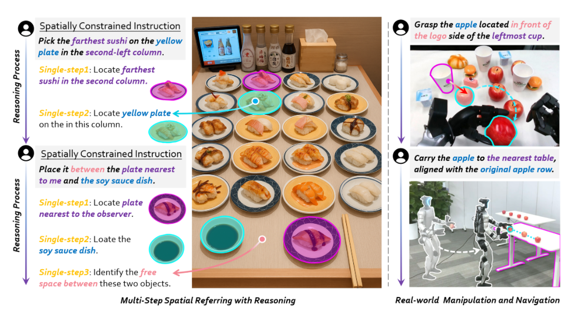
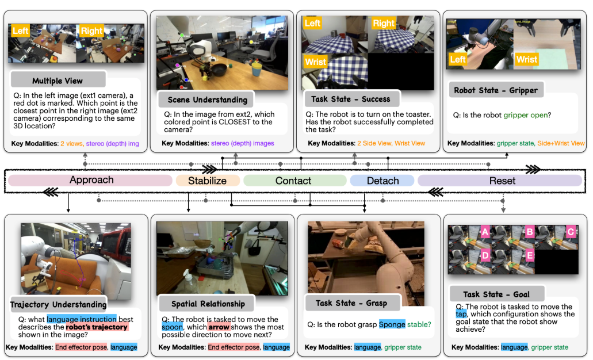
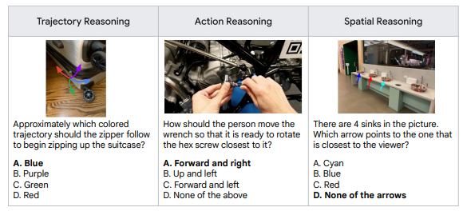
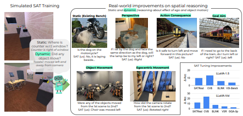
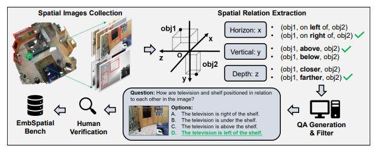
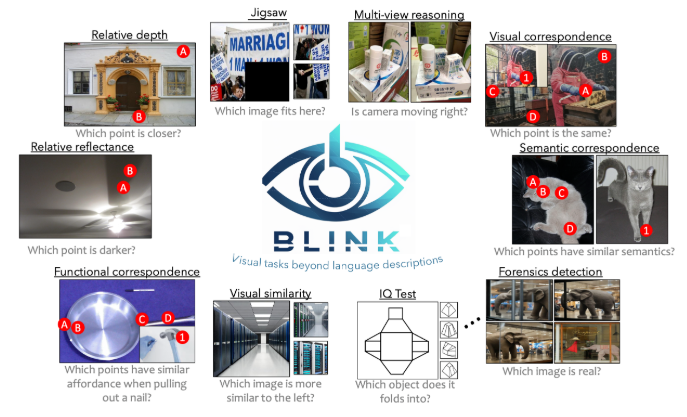
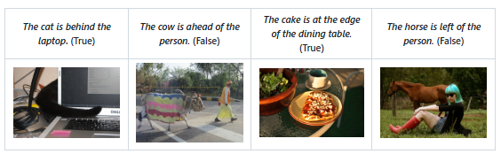

    <h1>Awesome Spatial Intelligence in VLM</h1>
    
    

This is a collection of research papers about Spatial Intelligence in VLM. 

If you wish to include your paper, update any details (e.g., code URLs, conference information), or share suggestions, please feel free to submit a pull request, send me an email, or leave a comment in the Issues section. Your input is greatly appreciated!

* Methods  
Focus on collecting relevant work centered around model training. Some may include datasets and benchmarks, which will be annotated as much as possible.
* Dataset  
Focus on collecting datasets related to spatial intelligence. Some may involve SFT (Supervised Fine-Tuning) processes.
* Benchmark  
Focus on collecting relevant evaluation benchmarks.

## Methods
### Image Based
|              Title              |                    Introduction                    |     Date     |      Code      |    Dataset Open    |  Benchmark  |
| :-----------------------------: | :------------------------------------------------: | :----------: | :------------: | :----------------: | :---------: |
|  [RoboRefer: Towards Spatial Referring with Reasoning in Vision-Language Models for Robotics](https://arxiv.org/pdf/2506.04308) |  | 2025-5 | [Github](https://zhoues.github.io/RoboRefer/) | √ | √ |

## Dataset
### Image Based
|              Title              |                    Introduction                    |     Date     |      Code      |    SFT Code    |
| :-----------------------------: | :------------------------------------------------: | :----------: | :------------: | :------------: |
|  [Robo2VLM: Visual Question Answering from Large-Scale In-the-Wild Robot Manipulation Datasets](https://arxiv.org/abs/2505.15517) |  | 2025-6 | [Github](https://berkeleyautomation.github.io/robo2vlm/) | √ |

## Benchmarks
|              Title              |                    Introduction                    |     Date     |      Code      |    SFT Data    |
| :-----------------------------: | :------------------------------------------------: | :----------: | :------------: | :------------: |
|  [Embodied Reasoning QA Evaluation Dataset](https://storage.googleapis.com/deepmind-media/gemini-robotics/gemini_robotics_report.pdf) |  | 2025-5 | [Github](https://github.com/embodiedreasoning/ERQA) | × |
|  [SAT: Dynamic Spatial Aptitude Training for Multimodal Language Models](https://arxiv.org/abs/2412.07755) |  | 2025-4 | [Github](https://github.com/arijitray1993/SAT) | √ |
|  [EmbSpatial-Bench: Benchmarking Spatial Understanding for Embodied Tasks with Large Vision-Language Models](https://arxiv.org/abs/2406.05756) |  | 2024-6 | [Github](https://github.com/mengfeidu/EmbSpatial-Bench) | √ |
|  [BLINK: Multimodal Large Language Models Can See but Not Perceive](https://arxiv.org/abs/2404.12390) |  | 2024-4 | [Github](https://github.com/zeyofu/BLINK_Benchmark) | × |
|  [VSR: Visual Spatial Reasoning](https://arxiv.org/abs/2205.00363) |  | 2023-5 | [Github](https://github.com/cambridgeltl/visual-spatial-reasoning) | √ |

